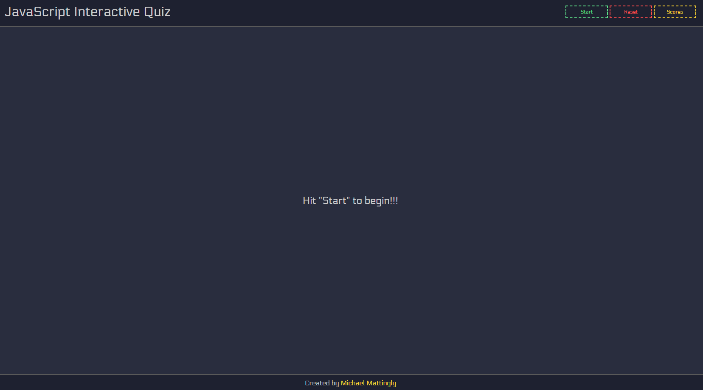

# Interactive Quiz Website

## Description



This interactive quiz website allows users to test their knowledge of Javascript. The questions are multiple-choice and are scored at the end to determine your score and if you are eligible for a leaderboard spot. This website utilizes both localStorage and a hosted JSON file to retrieve questions, answers and score data, which is then used in the browsers localStorage to have persistance. The website was created as a project during a bootcamp at UCB Ext. You can access the deployed website [here](https://meanbean87.github.io/interactive-quiz-website/).

## Technology Used

| Technology | Badge                                                           | Documentation                                                                    |
| ---------- | --------------------------------------------------------------- | -------------------------------------------------------------------------------- |
| HTML       |                | [HTML Documentation](https://developer.mozilla.org/en-US/docs/Web/HTML)             |
| CSS        |                    | [CSS Documentation](https://developer.mozilla.org/en-US/docs/Web/CSS)               |
| JavaScript |  | [JavaScript Documentation](https://developer.mozilla.org/en-US/docs/Web/JavaScript) |
| Git        |          | [Git Documentation](https://git-scm.com/)                                           |

## Javascript Example

This is the fetchData function that returns the questions and highScores data. It will first attempt to use localStorage and if not available will pull in information from the hosted API.

```javascript
const fetchData = async () => {
  try {
    if (isDataFetched) {
      console.log("Data has already been fetched.");
      return;
    }

    let storedQuestions = localStorage.getItem("questions");
    let storedHighScores = localStorage.getItem("highScores");

    if (storedQuestions && storedHighScores) {
      questionsData = JSON.parse(storedQuestions);
      highScoresData = JSON.parse(storedHighScores);
      console.log("Data fetched from localStorage successfully.");
    } else {
      const dataResponse = await fetch(
        "https://meanbean87.github.io/interactive-quiz-website/assets/javascript/data.json"
      );

      const dataObj = await dataResponse.json();

      if (localStorage.getItem("questions") === null) {
        localStorage.setItem(
          "questions",
          JSON.stringify(dataObj.questionsArray)
        );
        storedQuestions = localStorage.getItem("questions");
        questionsData = JSON.parse(storedQuestions);
        console.log(
          "Fetched 'questions' from repository and updated localStorage."
        );
      }

      if (localStorage.getItem("highScores") === null) {
        localStorage.setItem(
          "highScores",
          JSON.stringify(dataObj.highScoresArray)
        );
        storedHighScores = localStorage.getItem("highScores");
        highScoresData = JSON.parse(storedHighScores);
        console.log(
          "Fetched 'highScores' from repository and updated localStorage."
        );
      }
    }
  } catch (error) {
    console.log("Error fetching data:", error);
  }
  isDataFetched = true;
};
```

## Learning Points

Some of the key learning points from developing this website include:

- Handling user input and validating answers.
- Dynamically rendering content based on user interactions.
- Utilizing event listeners to capture user actions.
- Managing and displaying scores.

## Usage

To use the Interactive Quiz Website:

1. Visit the deployed site [here](https://meanbean87.github.io/interactive-quiz-website/).
2. Click the **Start** button.
3. A card will open, presenting you with a question.
4. Click on your chosen answer. The background color of the question will turn green for a
   correct answer or red for an incorrect answer. The background color of the correct answer
   will also be displayed in green. Text indicating "Correct" or "Incorrect" will be shown below
   the timer.
5. Another question will be presented to you. Continue answering until either the time runs out
   or you reach the end of the questions (20 questions in total).
6. Once the quiz is completed, your score will be displayed.
7. If eligible, you will have the option to enter your name to save the score. Afterward, you can
   view the leaderboard.
8. To view the high scores at any time, click the **Scores** button on the navbar.
9. If you wish to start the quiz over before it completes, click the **Reset** button at any time.

## Author Info

Michael Mattingly

- GitHub: [meanbean87](https://github.com/meanbean87)
- LinkedIn: [Michael Mattingly](https://www.linkedin.com/in/michael-mattingly-5580b1280/)

## Credits

- The Interactive Quiz Website was created by [meanbean87](https://github.com/meanbean87), with source code provided by UC Berkeley Extension.
- Favicon owned by Michael Mattingly.
- Fonts from Google Fonts CDN.

## License

This project is licensed under the [MIT License](LICENSE).
